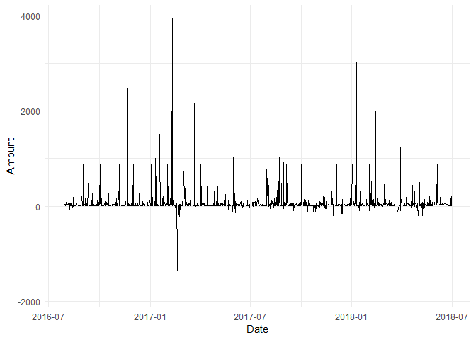
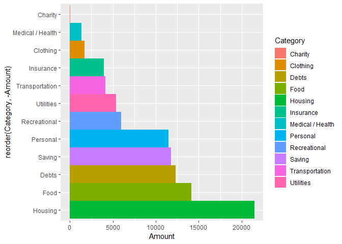
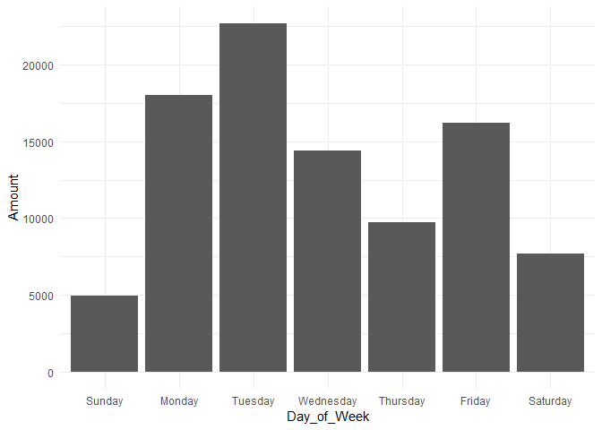
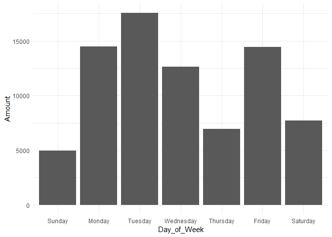
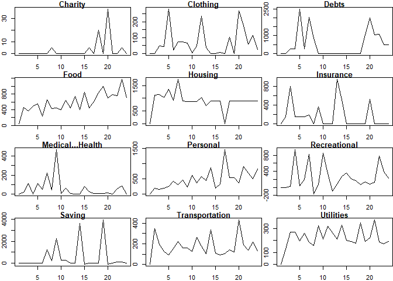
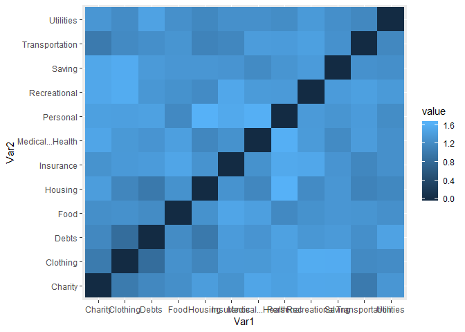
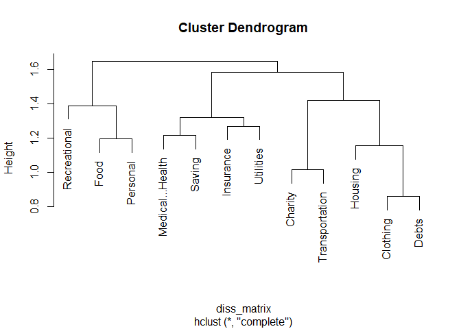

Post 2 - Finances
================
Jamie McKinnon
November 10, 2018

Data Collection and Pull
========================

This data is a collection of my household financial data from August 2016 - July 2018. Daily, in my household we record every transaction made via credit, debit, or cash purchases. There are no omissions from this data set. Each month, we set a budget for each category and fund. This sheet is used in collaboration with several other sheets, including income, to create our monthly budget.

For the purposes of this analysis, only monthly spending is included.

I downloaded this data from my personal Google Drive account.

Purpose
=======

The purpose of this analysis is to determine trends in our household spending over a two-year period. Furthermore, visualizing the amount of money spent in certain categories may help my household decide to reduce spending in those categories as a New Year’s Resolution. If we know how we spend money, and which days or times of the month we are most likely to spend money, we may recognize those patterns in the future and cut back.

Data Processing
===============

First, I turned the dataset into a tibble for easy output. The data required a little pre-processing to alter amounts and keep them numeric without commas in the thousands place. The lubridate package was used to manipulate the date column.

There were 13 entries over the two year that were not categorized or placed in a fund. I pull the note information on these to see if I can tell where they should have gone. There are few enough entries that I turn these into NA values so we can keep complete cases only.

I create a new column called wDay to represent the day of the week on which that date occurred. This will help with further analysis.

``` r
## READ DATA ##
Finances <- read.csv("C:/Users/jamie/Documents/BZAN/BZAN-552--Final-Portfolio-2/Finances.csv", header = T, stringsAsFactors = F)
Finances <- Finances[,c("Date", "Category", "Fund", "Amount", "Note")]


## PROCESS ##
Finances <- as.tibble(Finances)
head(unique(Finances$Amount), 20)
```

    ##  [1] "649.8"  "39.37"  "16.06"  "36.65"  "4.15"   "15.83"  "151.21"
    ##  [8] "4.37"   "998.71" "7.65"   "12.51"  "40"     "52.73"  "23.05" 
    ## [15] "-60.98" "19"     "8"      "12.03"  "20"     "3.27"

``` r
Finances$Amount <- gsub(",", "", Finances$Amount)
head(unique(Finances$Amount), 20)
```

    ##  [1] "649.8"  "39.37"  "16.06"  "36.65"  "4.15"   "15.83"  "151.21"
    ##  [8] "4.37"   "998.71" "7.65"   "12.51"  "40"     "52.73"  "23.05" 
    ## [15] "-60.98" "19"     "8"      "12.03"  "20"     "3.27"

``` r
Finances$Date <- lubridate::as_date(Finances$Date)
Finances[which(lubridate::year(Finances$Date) < 2016),]
```

    ## # A tibble: 0 x 5
    ## # ... with 5 variables: Date <date>, Category <chr>, Fund <chr>,
    ## #   Amount <chr>, Note <chr>

``` r
Finances[which(lubridate::year(Finances$Date) > 2018),]
```

    ## # A tibble: 0 x 5
    ## # ... with 5 variables: Date <date>, Category <chr>, Fund <chr>,
    ## #   Amount <chr>, Note <chr>

``` r
head(unique(Finances$Category))
```

    ## [1] "Insurance"        "Food"             "Housing"         
    ## [4] "Utilities"        "Medical / Health" "Personal"

``` r
Finances$Note[which(Finances$Category == "")]
```

    ##  [1] ""                          "Kroger - Medicine for GMA"
    ##  [3] "GMA paid back in cash"     "Blue Bar Rack Room"       
    ##  [5] "target"                    "ink pixi"                 
    ##  [7] "check"                     "Paypal Verification"      
    ##  [9] "Paypal Verification"       "Paypal Verification"      
    ## [11] "Academy Sports"            "Adjustment Deposit"       
    ## [13] "Blue Gold Deposit"

``` r
Finances$Category[which(Finances$Category == "")] <- NA

Finances$wDay <- lubridate::wday(Finances$Date, label = TRUE, abbr = FALSE)
Finances$Amount <- as.numeric(Finances$Amount)
boxplot(Finances$Amount)
```


``` r
Finances$Note[which(is.na(Finances$Amount))]
```

    ## [1] ""       "target"

``` r
Finances <- Finances[complete.cases(Finances),]


Finances$Month_Yr <- format(as.Date(Finances$Date), "%Y-%m")
length(unique(Finances$Month_Yr))
```

    ## [1] 24

Multivariate Visualization
==========================

Visualizations of data can be helpful in determining patterns. I use ggplot2 and dplyr to manipulate the data and create several visualizations that tell unique stories.

Daily Spending Over Time All Data
---------------------------------

This visualization shows the daily spending for the entire collection period. This is helpful for identifying major spikes to see what those occurrences are and to eliminate those occurrences from happening again, if possible. Consistently, the data seems to follow a pattern with normal periodic spikes up to 1000 dollars, with few outliers that can be identified above that. Using package plotly, and the function ggplotly on our ggplot output, in R from the Viewer tab we can hover over individual points to see exact amounts and dates of these occurrences. Unfortunately, for publishing to github, this is a function that cannot be reproduced in the .rmd file for graded submission, but can be opened and viewed in R. To view the plotly version, simply unhash line 90.

``` r
# Daily Spending over time #
Finances %>%
  ggplot(aes(x = Date, y = Amount)) +
  geom_line() + 
  theme_minimal() -> p
p
```



``` r
# ggplotly(p)
```

Spending by Month
-----------------

The following plots show the categorical spending by month in plots 1 and 2, and the cumulative spending by month in plot 3. From the first plot is may be difficult to see that January is our highest spending month, but the cumulative, plot 3, shows us easily by comparison to other months. The first plot and second plots do show us that Savings in January is the highest followed by Savings in August. This is easily explained because both myself and my husband are in grad school and we pay our tuition and fees in January and August. Monthly we contribute money to a savings account for tuition, and we remove it when the tuition is due.

Plot 2 shows us the consistency of our spending by month. There are a few outliers where Savings and Debts spike, but, other categories seem to be relatively consistent. This is a goal with our monthly budgeting. We hope that we can keep each category equal or as close to equal over time, so we can estimate how much money we would need any month. These data are collected over a two-year period. Therefore, the monthly spending should be approximately half of what is shown on the Y axis below.

``` r
Finances %>%
  group_by(Month = month(Date), Year = year(Date), Category) %>%
  summarise(Amount = sum(Amount)) -> Finances_Summary
```

    ## Warning: package 'bindrcpp' was built under R version 3.4.4

``` r
# Spending by month scatter
qplot(Month, Amount, data = Finances_Summary, colour = Category)
```


``` r
# Spending by month colored by category
Finances %>%
  group_by(Month = month(Date), Year = year(Date), Category) %>%
  summarise(Amount = sum(Amount)) %>%
  ggplot( aes(x = Month, y = Amount, fill = Category )) +
    geom_bar(stat="identity", position=position_dodge()) + 
    scale_x_continuous(breaks= c(1, 2, 3, 4, 5, 6, 7, 8, 9, 10, 11, 12)) +
    theme_minimal()
```


``` r
# Spending by month cummulative
Finances %>%
  group_by(Month = month(Date)) %>%
  summarise(Amount = sum(Amount)) %>%
  ggplot( aes(x = Month, y = Amount)) +
    geom_bar(stat="identity", position=position_dodge()) + 
    scale_x_continuous(breaks= c(1, 2, 3, 4, 5, 6, 7, 8, 9, 10, 11, 12)) +
    theme_minimal()
```


Spending by Category
--------------------

This plot shows us the amount spent over two years cumulatively in all categories. Here, we see that we've spent the most in the Housing category with a value over 20,000 dollars. This is a little depressing as we currently rent, and all that money is unrecoverable. The second category is food just below 15,000 dollars. For two years and two people, approximately 7000 dollars a year seems high for a food budget. After this analysis, we will consider reducing how much money we spend monthly on food to reduce our overall spending habits. Luckily, debt is our third highest category, which means we've paid off close to 12,500 dollars over the past two years. This is a category we would like to raise over the next year to more quickly pay off our student loans. Hopefully by reducing some of these other categories, we will be able to appropriate more funds to the debt category.

``` r
# Spending by category
Finances %>%
  group_by(Category) %>%
  summarise(Amount = sum(Amount)) %>%
  ggplot(aes(x = reorder(Category, -Amount), y = Amount, fill = Category)) + 
  geom_bar(width = 1, stat = "identity", position = position_dodge()) + 
  coord_flip()
```



Spending by Day of Week
=======================

By looking at the day of the week where we spend the most money, we may be able to catch unhealthy spending habits. I expected this plot to have higher spending on the weekends, which would reinforce my hypothesis of unhealthy spending as recovery from weekday struggles. The only explanation I have for this is stores not processing sales on weekends but waiting until the following workweek. Therefore, by the time it posts to the bank account, it is 2-3 days after the actual day the money was spent. A better data collection process would help correct this process if we kept our receipts and posted them as we paid for things rather than when they posted to the bank account.

The second plot in this section removes rent and debt from the daily plots since those are large spending categories, but uncontrollable due to the due date. Still, we see the same plot, only with a reduced y axis. This does not provide further insight into the day of week spending.

``` r
# Spending by day of week
Finances %>%
  group_by(Day_of_Week = wDay) %>%
  summarise(Amount = sum(Amount)) %>%
  ggplot( aes(x = Day_of_Week, y = Amount)) +
    geom_bar(stat="identity", position=position_dodge()) + 
    theme_minimal()
```



``` r
'%nin%' <- function(x,y)!('%in%'(x,y))

# Spending by day of week - excluding rent and debt
Finances[which(Finances$Fund %nin% c("Rent", "Debt")),] %>%
  group_by(Day_of_Week = wDay) %>%
  summarise(Amount = sum(Amount)) %>%
  ggplot( aes(x = Day_of_Week, y = Amount)) +
    geom_bar(stat="identity", position=position_dodge()) + 
    theme_minimal()
```



Frequency of Occurrences
========================

The plot\_bar function from the DataExplorer package displays the most frequently occurring Categories, days of the week, and month\_year. This shows us that the food category is the most frequently assigned category with over 600 occurances in 2 years. This is followed closely by personal, with a frequency over 400. By reducing these two categories, we may be able to re-allocate the spending elsewhere, preferably to paying off debts.

``` r
plot_bar(Finances)
```

    ## 3 columns ignored with more than 50 categories.
    ## Date: 581 categories
    ## Fund: 54 categories
    ## Note: 876 categories


Reformatting Data for Time Series Clustering
============================================

To perform time series clustering using the TSclust package the data must be in n X p matrix format with no NA values for Amount. From the original data we select the category, Month\_Yr, a created column from date, and the Amount. I manipulate this to group by category and month\_yr to summarize how much money was spent in each category over the two-year period. This is then turned into a matrix format by spreading the data. The diss function from the TSclust package requires the transpose of the current setup where the columns are categories and the rows are months. The data is manipulated to accommodate this for the next section.

Unfortunately, manipulating the data while the .Rmd was connected to github was not as simple as manipulating it in the .Rmd synced only to my desktop. There were problems in the dplyr function that wouldn't allow for group\_by manipulation within this file without performing elsewhere and saving the data as a csv, then loading that csv to transform to a matrix. This is why the process is more obscure than I'd have preferred.

``` r
Finances %>%
  select(Category, Month_Yr, Amount) -> Finances_Sub

Finances %>%
  select(Category, Month_Yr, Amount) %>%
  group_by(Category, Month_Yr) %>%
  summarise(Amount = sum(Amount)) %>%
  spread(key = Category, value = Amount) -> Finances_Sub

#write.csv(Finances_Sub, "Finances_Sub.csv")

Finances_Sub <- read.csv("C:/Users/jamie/Documents/BZAN/BZAN-552--Final-Portfolio-2/Finances_Sub.csv", row.names = 1)


Finances_Sub <- t(as.matrix(Finances_Sub))
colnames(Finances_Sub) <- Finances_Sub[1,]
Finances_Sub <- Finances_Sub[-1,]
Categories <- rownames(Finances_Sub)

Finances_Sub <- apply(Finances_Sub, 2, as.numeric)
rownames(Finances_Sub) <- Categories

Finances_Sub <- replace_na(Finances_Sub, 0)

# Get an idea of what these data look like - we can put together a compound time series plot
par(mfrow=c(4,3))
par(mar=c(2,2,1,0))
for(i in 1:12){
    plot(Finances_Sub[i,], main=rownames(Finances_Sub)[i], type="l")
}
```



Correlation
===========

The correlation of a data set tells us the degree of similarity. Here, we will be generating a dissimilarity matrix between time series.

The matrix created, diss\_matrix, is a measure of dissimilarity. The range of correlation is a measure from \[0,2\] where 2 is the most dissimilar categories.

``` r
diss_matrix <- diss(Finances_Sub, "COR")
summary(diss_matrix)
```

    ##    Min. 1st Qu.  Median    Mean 3rd Qu.    Max. 
    ##  0.8611  1.2306  1.3235  1.3267  1.4172  1.6449

``` r
melted_dissmat <- melt(as.matrix(diss_matrix))
head(melted_dissmat)
```

    ##        Var1    Var2    value
    ## 1   Charity Charity 0.000000
    ## 2  Clothing Charity 1.020816
    ## 3     Debts Charity 1.175676
    ## 4      Food Charity 1.260073
    ## 5   Housing Charity 1.419980
    ## 6 Insurance Charity 1.302664

``` r
# which categories are the most dissimilar
melted_dissmat[order(-melted_dissmat$value),]
```

    ##                 Var1             Var2     value
    ## 56          Personal          Housing 1.6449351
    ## 89           Housing         Personal 1.6449351
    ## 80          Personal Medical...Health 1.6224750
    ## 91  Medical...Health         Personal 1.6224750
    ## 21      Recreational         Clothing 1.5853022
    ## 98          Clothing     Recreational 1.5853022
    ## 22            Saving         Clothing 1.5833588
    ## 110         Clothing           Saving 1.5833588
    ## 68          Personal        Insurance 1.5525325
    ## 90         Insurance         Personal 1.5525325
    ## 9       Recreational          Charity 1.5385814
    ## 97           Charity     Recreational 1.5385814
    ## 69      Recreational        Insurance 1.5346559
    ## 102        Insurance     Recreational 1.5346559
    ## 10            Saving          Charity 1.5293098
    ## 109          Charity           Saving 1.5293098
    ## 7   Medical...Health          Charity 1.5121618
    ## 73           Charity Medical...Health 1.5121618
    ## 42         Insurance             Food 1.5101147
    ## 64              Food        Insurance 1.5101147
    ## 36         Utilities            Debts 1.4810047
    ## 135            Debts        Utilities 1.4810047
    ## 32          Personal            Debts 1.4618654
    ## 87             Debts         Personal 1.4618654
    ## 8           Personal          Charity 1.4498701
    ## 85           Charity         Personal 1.4498701
    ## 107   Transportation     Recreational 1.4486301
    ## 129     Recreational   Transportation 1.4486301
    ## 43  Medical...Health             Food 1.4427381
    ## 76              Food Medical...Health 1.4427381
    ## 20          Personal         Clothing 1.4421947
    ## 86          Clothing         Personal 1.4421947
    ## 5            Housing          Charity 1.4199800
    ## 49           Charity          Housing 1.4199800
    ## 83    Transportation Medical...Health 1.4088968
    ## 127 Medical...Health   Transportation 1.4088968
    ## 30         Insurance            Debts 1.4021551
    ## 63             Debts        Insurance 1.4021551
    ## 106           Saving     Recreational 1.4008256
    ## 117     Recreational           Saving 1.4008256
    ## 95    Transportation         Personal 1.4004744
    ## 128         Personal   Transportation 1.4004744
    ## 81      Recreational Medical...Health 1.3920864
    ## 103 Medical...Health     Recreational 1.3920864
    ## 93      Recreational         Personal 1.3881821
    ## 104         Personal     Recreational 1.3881821
    ## 34            Saving            Debts 1.3870585
    ## 111            Debts           Saving 1.3870585
    ## 108        Utilities     Recreational 1.3833518
    ## 141     Recreational        Utilities 1.3833518
    ## 18         Insurance         Clothing 1.3744532
    ## 62          Clothing        Insurance 1.3744532
    ## 19  Medical...Health         Clothing 1.3704216
    ## 74          Clothing Medical...Health 1.3704216
    ## 33      Recreational            Debts 1.3490324
    ## 99             Debts     Recreational 1.3490324
    ## 46            Saving             Food 1.3451545
    ## 112             Food           Saving 1.3451545
    ## 12         Utilities          Charity 1.3445061
    ## 133          Charity        Utilities 1.3445061
    ## 58            Saving          Housing 1.3377057
    ## 113          Housing           Saving 1.3377057
    ## 94            Saving         Personal 1.3289189
    ## 116         Personal           Saving 1.3289189
    ## 47    Transportation             Food 1.3244311
    ## 124             Food   Transportation 1.3244311
    ## 31  Medical...Health            Debts 1.3225318
    ## 75             Debts Medical...Health 1.3225318
    ## 70            Saving        Insurance 1.3208515
    ## 114        Insurance           Saving 1.3208515
    ## 54         Insurance          Housing 1.3067178
    ## 65           Housing        Insurance 1.3067178
    ## 6          Insurance          Charity 1.3026642
    ## 61           Charity        Insurance 1.3026642
    ## 67  Medical...Health        Insurance 1.2892619
    ## 78         Insurance Medical...Health 1.2892619
    ## 45      Recreational             Food 1.2890506
    ## 100             Food     Recreational 1.2890506
    ## 41           Housing             Food 1.2888638
    ## 52              Food          Housing 1.2888638
    ## 119   Transportation           Saving 1.2864676
    ## 130           Saving   Transportation 1.2864676
    ## 16              Food         Clothing 1.2827930
    ## 38          Clothing             Food 1.2827930
    ## 48         Utilities             Food 1.2762290
    ## 136             Food        Utilities 1.2762290
    ## 84         Utilities Medical...Health 1.2755174
    ## 139 Medical...Health        Utilities 1.2755174
    ## 72         Utilities        Insurance 1.2691825
    ## 138        Insurance        Utilities 1.2691825
    ## 120        Utilities           Saving 1.2650838
    ## 142           Saving        Utilities 1.2650838
    ## 35    Transportation            Debts 1.2610355
    ## 123            Debts   Transportation 1.2610355
    ## 4               Food          Charity 1.2600727
    ## 37           Charity             Food 1.2600727
    ## 96         Utilities         Personal 1.2332696
    ## 140         Personal        Utilities 1.2332696
    ## 24         Utilities         Clothing 1.2297754
    ## 134         Clothing        Utilities 1.2297754
    ## 28              Food            Debts 1.2237025
    ## 39             Debts             Food 1.2237025
    ## 57      Recreational          Housing 1.2183851
    ## 101          Housing     Recreational 1.2183851
    ## 82            Saving Medical...Health 1.2151721
    ## 115 Medical...Health           Saving 1.2151721
    ## 23    Transportation         Clothing 1.2040316
    ## 122         Clothing   Transportation 1.2040316
    ## 44          Personal             Food 1.1942873
    ## 88              Food         Personal 1.1942873
    ## 132        Utilities   Transportation 1.1789072
    ## 143   Transportation        Utilities 1.1789072
    ## 3              Debts          Charity 1.1756757
    ## 25           Charity            Debts 1.1756757
    ## 60         Utilities          Housing 1.1740614
    ## 137          Housing        Utilities 1.1740614
    ## 71    Transportation        Insurance 1.1717575
    ## 126        Insurance   Transportation 1.1717575
    ## 55  Medical...Health          Housing 1.1703611
    ## 77           Housing Medical...Health 1.1703611
    ## 17           Housing         Clothing 1.1542257
    ## 50          Clothing          Housing 1.1542257
    ## 59    Transportation          Housing 1.1240529
    ## 125          Housing   Transportation 1.1240529
    ## 2           Clothing          Charity 1.0208160
    ## 13           Charity         Clothing 1.0208160
    ## 11    Transportation          Charity 1.0167188
    ## 121          Charity   Transportation 1.0167188
    ## 29           Housing            Debts 1.0053525
    ## 51             Debts          Housing 1.0053525
    ## 15             Debts         Clothing 0.8611069
    ## 26          Clothing            Debts 0.8611069
    ## 1            Charity          Charity 0.0000000
    ## 14          Clothing         Clothing 0.0000000
    ## 27             Debts            Debts 0.0000000
    ## 40              Food             Food 0.0000000
    ## 53           Housing          Housing 0.0000000
    ## 66         Insurance        Insurance 0.0000000
    ## 79  Medical...Health Medical...Health 0.0000000
    ## 92          Personal         Personal 0.0000000
    ## 105     Recreational     Recreational 0.0000000
    ## 118           Saving           Saving 0.0000000
    ## 131   Transportation   Transportation 0.0000000
    ## 144        Utilities        Utilities 0.0000000

``` r
ggplot(data = melted_dissmat, aes(x=Var1, y=Var2, fill=value)) + 
  geom_tile()
```



Most Unique Time Series
=======================

Here, we see that the personal category has the highest value, and therefore, the most unique time series. The personal category in our financial data represents money we allow ourselves to spend on whatever we would like. Monthly we appropriate a small fixed amount, but we don't always spend it every month. Sometimes we wait several months to spend in one lump sum. This make sense that it is the most unique times series, because there are no monthly requirements to the spending.

``` r
sort(rowMeans(as.matrix(diss_matrix)))
```

    ##   Transportation          Housing            Debts         Clothing 
    ##         1.152117         1.153720         1.160877         1.175707 
    ##        Utilities             Food          Charity           Saving 
    ##         1.175907         1.203120         1.214196         1.249992 
    ## Medical...Health        Insurance     Recreational         Personal 
    ##         1.251802         1.252862         1.294007         1.309917

Hierarchical Clustering on the Dissimilarity Matrix
===================================================

Hierarchical clustering on the dissimilarity matrix visualizes the matrix output from above. Overall, the clustering of these categories based on amount spent per month only explains the consistency of money spent over time.

Here, we see that clothing and debts are the most similar in the time series dataset with housing being a part of the cluster as well. These are likely some of our most consistent categories over time, with housing and debts being big spenders.

``` r
fit <- hclust(diss_matrix)
plot(fit)
```



Conclusion
==========

Based on this analysis, our household will try to reduce food spending and personal spending, so those funds can be re-allocated to more important categories like Debts. This analysis has shed light on our current spending habits and, hopefully, will help to improve our finances in the future.
